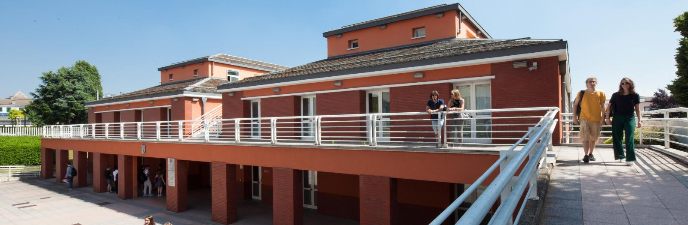

# University of Bergamo (UNIBG)

## Department of Engineering and Applied Sciences

### Industrial Electronics – Microcontrollers and Control Applications with Arduino

---

## 📘 About the Course
This repository contains the material for the **Industrial Electronics laboratory module on microcontrollers** offered at the Department of Engineering and Applied Sciences (Dalmine Campus).  

The module focuses on the **practical use of microcontrollers (Arduino platform)** to demonstrate how **sensors, transducers, amplifiers, and actuators** are integrated into control systems for industrial processes.  

- **Total duration:** 16 hours  
- **Format:** 8 sessions of 2 hours (or 6 sessions of ~3 hours), all in the laboratory  
- **Language:** English  
- **Lab resources:** 10 Arduino kits available (2 students per kit, class size usually ~20 students)  

> ⚠️ If the number of students exceeds the availability of kits, laboratory sessions may be duplicated to ensure all participants have access to the hardware.  

---

## 🎯 Learning Objectives
By the end of this course, students will be able to:
- Understand the structure and role of **microcontrollers** in industrial control systems.  
- Identify and classify different types of **transducers** (position, velocity, acceleration, temperature, deformation, etc.).  
- Use **signal conditioning circuits** (amplifiers, bridges, filters) to prepare sensor signals for microcontrollers.  
- Implement control of **actuators** (LEDs, buzzers, DC motors, stepper motors, servo systems).  
- Apply concepts of **feedback and closed-loop control** using Arduino-based prototypes.  
- Relate theoretical concepts of **Industrial Electronics** with practical experiments.  

---

## 🗓️ Course Structure
The laboratory sessions follow the structure of the main Industrial Electronics syllabus, but adapted to what is available in the Arduino kits:

### 1. Introduction to Microcontrollers
- Microcontroller architecture and applications in control systems.  
- Setup of Arduino IDE, first sketches (LED blink, push button input).  

### 2. Transducers – Position and Light
- Potentiometer as a position transducer.  
- LDR and photodiodes (GL5528, PT5I850AC) as light transducers.  
- Laboratory: LED Button Circuit, Potentiometer LED Control, Glow in the Dark Circuit.  

### 3. Transducers – Temperature and Motion
- LM35 temperature sensor, calibration, and real-time plotting.  
- PIR sensor for motion detection.  
- Tilt switch as a position/acceleration demonstration.  
- Laboratory: Temperature acquisition with Arduino plotter, PIR-based switch.  

### 4. MEMS and Inertial Measurement
- MPU6050 6DOF sensor (accelerometer + gyroscope).  
- MEMS principles and applications in industrial monitoring.  
- Laboratory: Motion detection and visualization.  

### 5. Signal Conditioning Circuits
- Amplifiers (simple current amplifier, Darlington pair).  
- Voltage dividers and bridge circuits.  
- Laboratory: Simple Current Amplifier, Logic Gates (AND/OR/NOT with transistors).  

### 6. Actuators – Fundamentals
- Driving LEDs, buzzers, and speakers.  
- PWM control of brightness and sound.  
- Laboratory: Arduino Light Theremin, Sound-reactive LED circuit.  

### 7. Actuators – Motors and Power Devices
- Theory of DC motors, stepper motors, and power switches (BJT, MOSFET, TRIAC).  
- Practical demos with kit actuators (substituting real motors with LEDs or buzzers for visualization).  
- Laboratory: Stepper motor driving (if hardware is available), otherwise simulation.  

### 8. Microcontrollers in Control Systems
- Closed-loop control concept (sensor → conditioning → microcontroller → actuator).  
- Mini-project: Students design a small control system (e.g., temperature-based fan, light-controlled buzzer, motion alarm).  
- Presentation of results.  

---

## 🧰 Available Hardware (Arduino Kit)
- **Board & Base:** DFRduino UNO R3, USB cable, expansion shield, breadboard with holder.  
- **Sensors:**  
  - Potentiometers (x3)  
  - Ambient light sensors (PT5I850AC, GL5528)  
  - LM35 temperature sensor  
  - Tilt switch sensor  
  - PIR motion sensor  
  - Analog sound sensor (microphone)  
  - MPU6050 (6DOF accelerometer + gyroscope)  
  - IR receiver diode  
- **Actuators:**  
  - LEDs (10x 5mm)  
  - 8-segment LED display  
  - Buzzer  
  - Digital speaker module  
- **Discrete Components:**  
  - Resistors (220Ω, 1kΩ, 4.7kΩ, 10kΩ)  
  - Transistor 2N3904  
  - Breadboard jumpers  
- **Others:**  
  - Mini push buttons  
  - MicroSD module  
  - Remote control with CR2025 battery  

---

📂 Repository Structure
├── lessons/           # Lessons separated by week or activity (Lab01.md, Lab02.md, etc.)
│   ├── code/          # Arduino sketches for each lesson
│   └── notes/         # Complementary notes or datasheets
├── images/            # Photos and figures for documentation
└── README.md          # Course overview (this file)

---

## 🚀 How to Use
1. Clone this repository:  
   ```bash
   git clone https://github.com/dhiegofc/instrual_electronics.git
