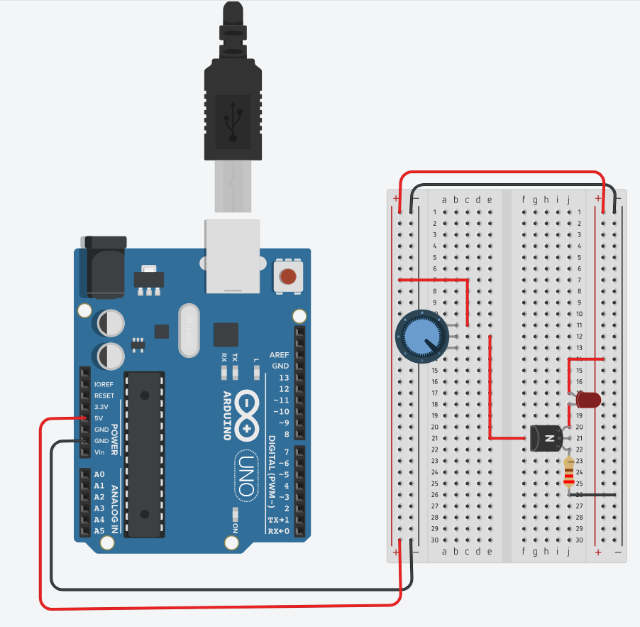
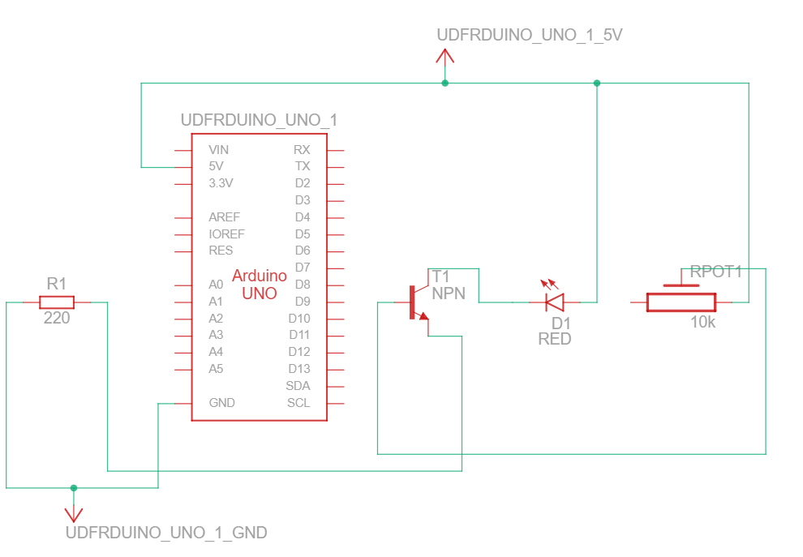
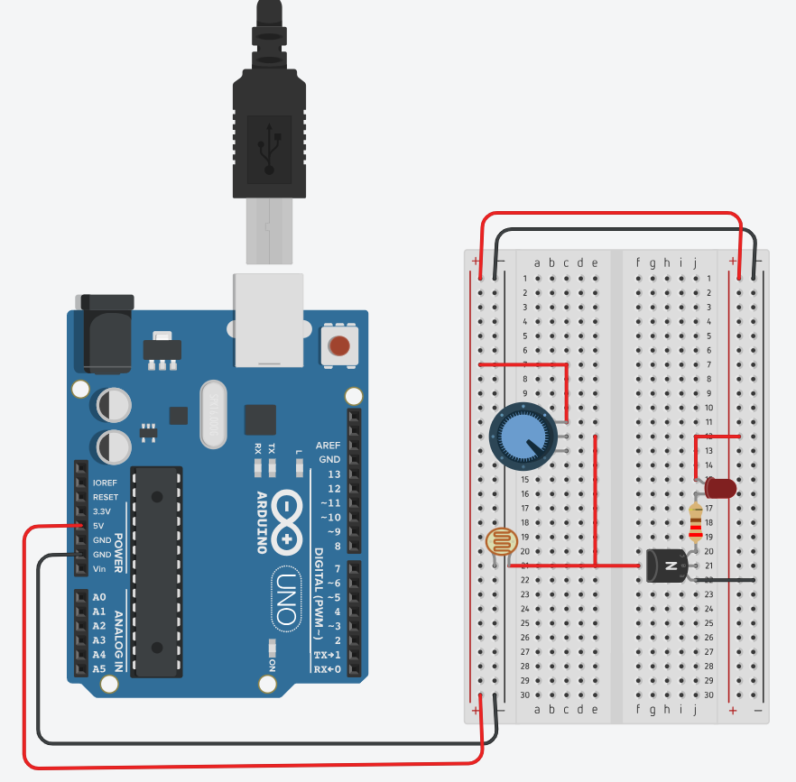
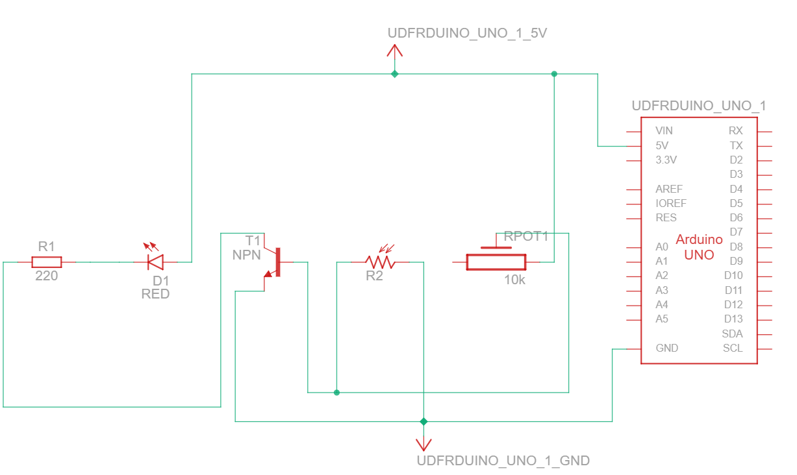

# Potentiometer and NPN Transistor Control Circuits (2N3904)

## 🎯 Objective

In this activity, students will explore how a **small change in voltage at the transistor base** can control a **larger current through the collector**, demonstrating the **amplification principle** of a transistor.  
The activity is divided into two parts:

1. **Transistor Controlled by Potentiometer**  
2. **Glow in the Dark Circuit** (adding an LDR sensor)

---

## 🛠️ What You’ll Need

For both parts, you will use:

- **DFRduino UNO R3** (used only as 5V power supply)  
- **Breadboard (400 tie-points or similar)**  
- **Transistor NPN 2N3904**  
- **10 kΩ Potentiometer**  
- **LED (5 mm)**  
- **220 Ω resistor** (current limiter)  
- **LDR (photoresistor)** – *used only in Part 2*  
- **Jumper wires (male-to-male)**  
- **USB cable (A–B)** – to power the Arduino board  

---

## ⚠️ Important Notes Before You Start

Before assembling the circuit, identify the **emitter (E)**, **base (B)**, and **collector (C)** pins of your **2N3904 transistor**.  
You can check the correct pin configuration in the datasheet provided by the professor:  
👉 [2N3904 Datasheet (PDF)](../../docs/2N3904.pdf)

> 🔎 Incorrect wiring of the transistor pins will cause the circuit not to work properly.

---

## ⚙️ Part 1 – Potentiometer Controlling a Transistor

### 📘 Description

In this first setup, the **potentiometer** controls the **base voltage** of the **2N3904 transistor**.  
As the potentiometer is turned, the **base current** increases or decreases, changing the **collector current** and, consequently, the **LED brightness**.

This allows students to visualize how **a small variation at the transistor base** affects a **larger current through the LED**.

---

### 🖼️ Breadboard Layout

  

### ⚙️ Circuit Diagram

  

---

### 🔍 Expected Behavior

- When the potentiometer knob is rotated, the LED brightness **gradually increases or decreases**.  
- This demonstrates **analog control** and the **current amplification** property of a transistor.  

---

## ⚙️ Part 2 – “Glow in the Dark” Circuit (LDR + Potentiometer + Transistor)

### 📘 Description

In this variation, an **LDR** (Light-Dependent Resistor) is added to the base circuit.  
The transistor now responds to **light intensity**:  
- When it’s **bright**, the LDR’s resistance is **low**, and the LED remains **off**.  
- When it’s **dark**, the LDR’s resistance is **high**, increasing base current, and the **LED lights up**.

The potentiometer is used to **adjust sensitivity**, defining the light level at which the LED turns on.

---

### 🖼️ Breadboard Layout

  

### ⚙️ Circuit Diagram

  

---

### 🔍 Expected Behavior

- In bright environments, the LED stays **off**.  
- When the light level drops, the LED **turns on gradually**, controlled by the transistor and LDR.  
- Adjusting the potentiometer changes the **light sensitivity threshold** for activation.  

---

## 🧭 Tips

- Always check transistor pin orientation (emitter, base, collector).  
- Make sure your **breadboard rails (5V and GND)** are properly powered from the Arduino.  
- The **potentiometer** and **LDR** form a **voltage divider**, providing variable voltage to the transistor base.  
- This circuit is an excellent demonstration of **sensor-based switching and analog control**.

