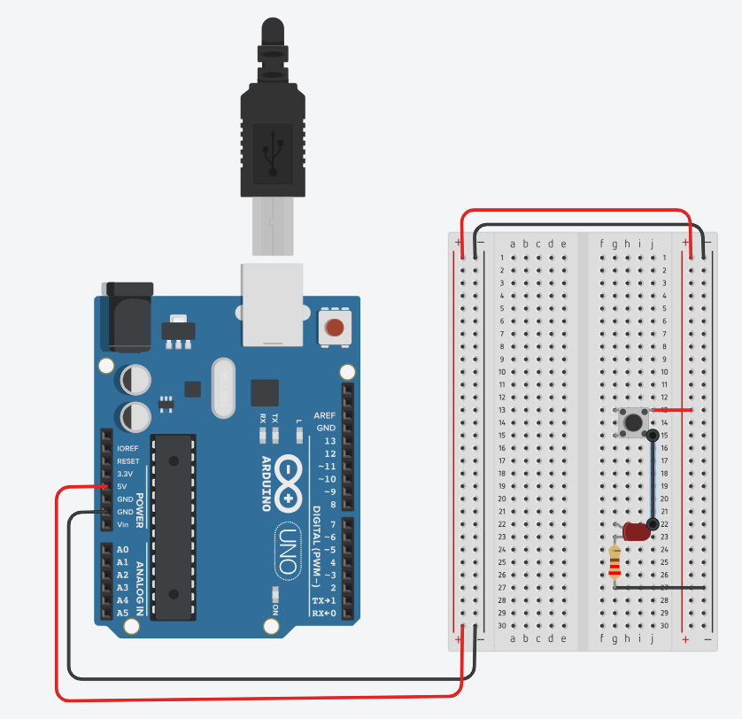
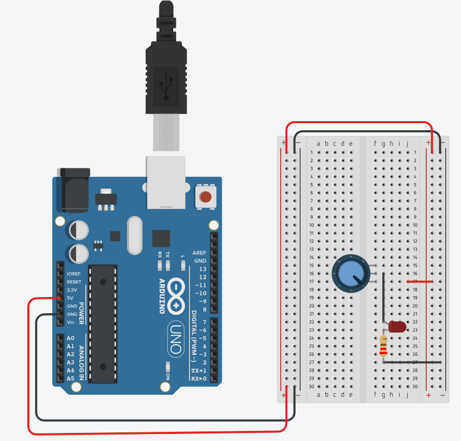

# LED Control using a Push Button and a Potentiometer

## 🎯 Objective

In this activity, students will learn how to **control an LED** using two different input devices — a **push button** and a **potentiometer** — while using the **Arduino UNO (DFRduino R3)** only as a **power source**.  

This first exercise introduces fundamental electronic principles such as **voltage division**, **digital switching**, and **current limiting**, while allowing students to become familiar with the **breadboard connections** and the **correct orientation of electronic components**.

---

## 🛠️ What You’ll Need

- **DFRduino UNO R3** (or Arduino UNO-compatible board) – used only as a 5V power source  
- **Breadboard (400 tie-points or similar)**  
- **LED (5 mm)**  
- **Resistor 220 Ω** – to limit LED current  
- **10 kΩ Potentiometer**  
- **Push button (momentary switch)**  
- **Jumper wires (male-to-male)**  
- **USB cable (A–B)** – to power the Arduino board from your computer  

---

## ⚠️ Important Note on LED Orientation

When inserting the LED on the breadboard:

- The **longer leg** is the **anode (+)** → connects to the **positive (5V)** side.  
- The **shorter leg** is the **cathode (−)** → connects to **GND (through a resistor)**.  

> ⚠️ Reversing the LED polarity will prevent it from lighting up and may damage it if connected incorrectly for a long time.

---

## ⚙️ Step-by-Step Assembly

### 1. 🔘 Push Button Control (Digital Switching)

1. Disconnect the Arduino from the computer before wiring.  
2. Place the **LED** and the **220 Ω resistor** in series on the breadboard.  
3. Connect the **push button** so that it bridges the central gap of the breadboard.  
4. Wire one side of the button to **5V**, and the opposite side to the LED-resistor circuit.  
5. Connect the LED cathode (through the resistor) to **GND**.  
6. When powered, pressing the button will complete the circuit and light up the LED.

🖼️ Example Circuit (Tinkercad):
<p align="center">
  
</p>

---

### 2. 🎚️ Potentiometer Control (Analog Adjustment)

1. Remove the button connections, keeping the LED circuit.  
2. Place the **10 kΩ potentiometer** on the breadboard.  
3. Connect:
   - **Left pin → 5V**
   - **Right pin → GND**
   - **Middle pin (wiper) → LED through 220 Ω resistor**
4. Turning the potentiometer will vary the voltage at the LED, gradually changing its brightness.

🖼️ Example Circuit (Tinkercad):
<p align="center">
  
</p>

---

## 🔍 Expected Behavior

- When using the **button**, the LED should turn ON only while the button is pressed.  
- When using the **potentiometer**, the LED brightness should change smoothly as you rotate the knob.  

These exercises help students **understand the difference between digital and analog control** and reinforce **safe component handling and circuit wiring**.

---

## 🧭 Tips

- Always double-check your connections before powering the Arduino.  
- Ensure the **breadboard rails** (power and ground) are properly linked.  
- If the LED doesn’t light up, verify the resistor and LED polarity.  
- The Arduino **is not yet programmed** in this activity — it only provides **regulated power** (5V and GND).

---

## 📂 Directory Structure

```plaintext
week01/
└── sources/
    ├── README.md              # This file
    ├── programs/              # (empty for now — no Arduino code required)
    └── lesson_images/
        ├── button_led_circuit.png
        └── potentiometer_led_circuit.png
