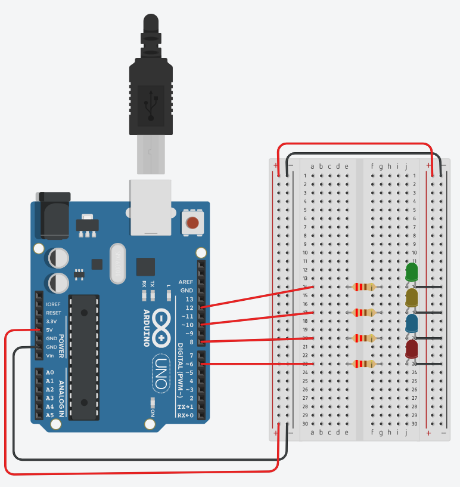
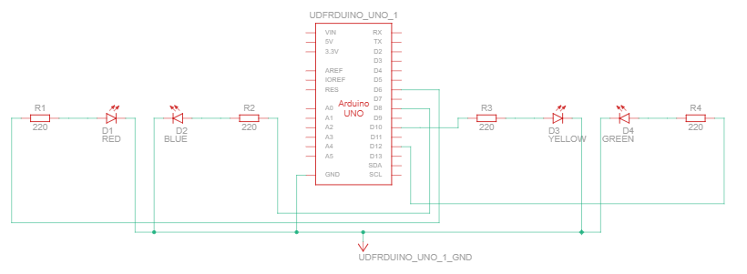
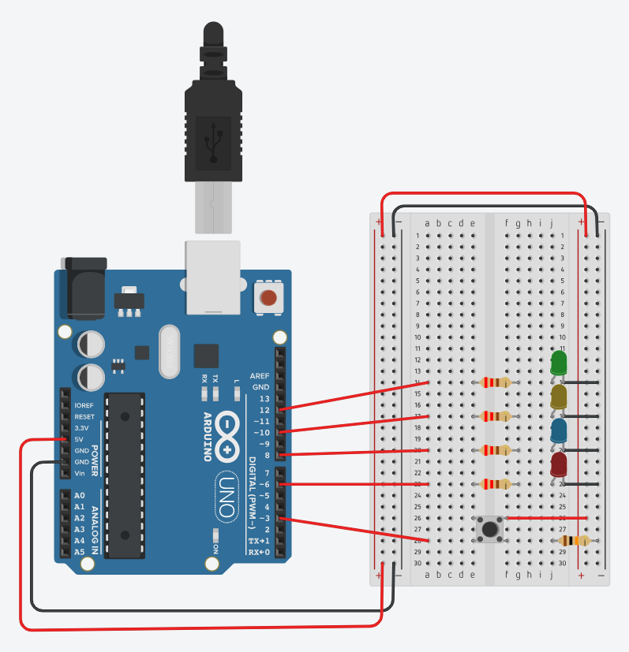
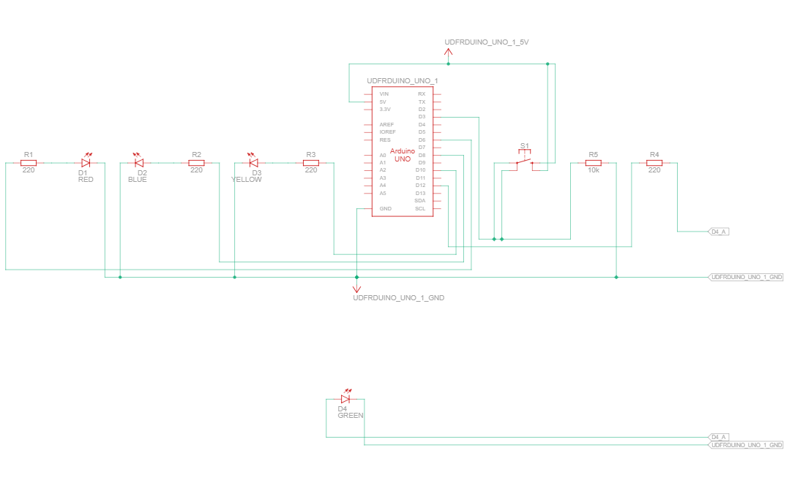

# Digital Outputs and Inputs with Arduino UNO

## 🎯 Objective

In this session, students will learn how to use the **Arduino IDE** to program **digital outputs and inputs** on the **Arduino UNO (DFRduino R3)**.  
Through two experiments, students will understand how to control LEDs via code and how digital inputs (buttons) can dynamically modify that behavior.

---

## ⚙️ Prerequisites

Before starting, make sure that:

- The **Arduino IDE** is installed on your computer ([https://www.arduino.cc/en/software](https://www.arduino.cc/en/software))  
- The **Arduino UNO** is connected via USB cable  
- In the IDE, select:
  - **Tools → Board → Arduino UNO**  
  - **Tools → Port → (your COM port)**  

Then click **Verify (✓)** to compile and **Upload (→)** to send the program to your board.

---

## 🛠️ What You’ll Need

- Arduino UNO (DFRduino R3)  
- Breadboard  
- 4 LEDs (5 mm)  
- 4 Resistors (220 Ω)  
- 1 Push Button (momentary switch) *(used in Activity 2)*
- 1 Resistor (10K Ω) *(used in Activity 2)*  
- Jumper wires (male-to-male)  
- USB cable (A–B)  

---

## ⚙️ Activity 1 – Controlling 4 LEDs (Digital Outputs)

### 📘 Description

In this activity, students will program **four digital outputs** to control four LEDs connected to the Arduino UNO.  
Each LED will **turn on and off randomly** according to the program logic.  
This experiment demonstrates how the Arduino can manage multiple outputs using **digital pins**.

🧠 Students are encouraged to experiment with:
- Changing which pins are used for LEDs  
- Modifying the time interval between changes  
- Creating custom LED patterns  

---

### 🖼️ Breadboard Layout

  

### ⚙️ Circuit Diagram

  

---

### 💻 Arduino Sketch

👉 [week_02_activity_01_leds.ino](../programs/week_02_activity_01_controlling_leds/week_02_activity_01_controlling_leds.ino)

Upload this sketch to your Arduino UNO.  
The code generates random sequences of LED blinking using the `random()` function and `digitalWrite()`.

---

### 🔍 Expected Behavior

- LEDs turn **on and off** in a random order.  
- The sequence changes continuously, illustrating how **digital outputs** work independently.  
- Modifying delay values or random ranges will change the blinking rhythm.

---

## ⚙️ Activity 2 – Button-Controlled Random LED Sequence

### 📘 Description

In this second activity, students will combine **digital inputs and outputs**.  
All four LEDs will stay **OFF**, and when the **push button** is pressed, the LEDs will remain **ON**, the LEDs return to their **steady OFF state** when the button is released.

This activity demonstrates how **input events** can directly influence **output behavior** in real time — a core concept in control systems.

---

### 🖼️ Breadboard Layout

  

### ⚙️ Circuit Diagram

  

---

### 💻 Arduino Sketch

👉 [week_02_activity_01_controlling_leds_button.ino](../programs/week_02_activity_01_controlling_leds_button/week_02_activity_01_controlling_leds_button.ino)

Upload the provided sketch to your Arduino UNO using the Arduino IDE.  
The program detects the button state with `digitalRead()` and uses it to modify how the LEDs behave.

---

### 🔍 Expected Behavior

- **Without pressing the button:** All four LEDs remain **OFF**.  
- **While pressing the button:** All four LEDs remain **ON**.  

This activity demonstrates how a simple input can control the system’s logic and dynamically change output behavior. The students must write the code in order to have another led bahavior while pressing the button. 

---

## 🧠 Learning Outcome

By completing these two activities, students will:

- Understand the difference between **digital outputs** and **digital inputs**.  
- Learn how to use **`digitalWrite()`** and **`digitalRead()`** commands.  
- Observe the relationship between **hardware events** and **software control logic**.  
- Gain practical experience programming the **Arduino UNO** to interact with physical components.

---

## 🙏 Acknowledgment

These hands-on exercises are inspired by the  
🎥 [*Arduino Hero to Zero* YouTube playlist by Sanjin Dedić](https://www.youtube.com/playlist?list=PL_92WMXSLe_86NTWf0nchm-EmQIwccEye),  
which serves as the foundation for practical experimentation in this laboratory module.
