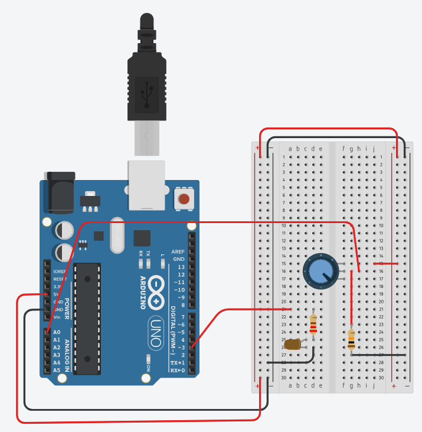
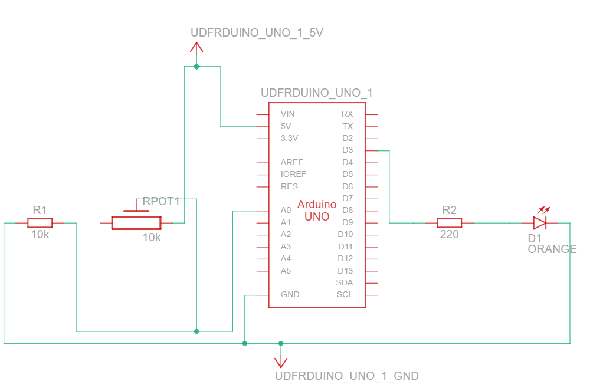
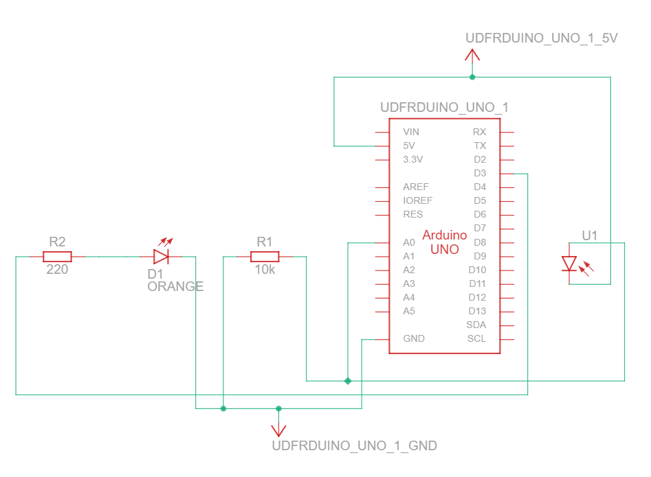

# Voltage Divider and Analog Input (PWM Dimmer with Arduino UNO)

## 🎯 Objective

In this session, students will explore how a **voltage divider** can generate an **analog input** for the Arduino (`analogRead()`) and how this signal can be used to control an **LED brightness** through **PWM output** (`analogWrite()`).  

Both activities use a **voltage divider** as the fundamental principle — one with a **potentiometer**, and the other with an **LDR (or photodiode)** and a **10 kΩ resistor** — to vary the voltage applied to the analog input pin.

Two experiments are proposed:

1. **Potentiometer** as a voltage divider → LED brightness follows the knob position.  
2. **LDR/photodiode with a 10 kΩ resistor** as a voltage divider → LED brightness changes with ambient light.  

> Note: The focus is on **voltage division, analog input reading, and PWM control**. Code and descriptions are written entirely **in English**.

---

## ⚙️ Prerequisites

- **Arduino IDE** installed: [https://www.arduino.cc/en/software](https://www.arduino.cc/en/software)  
- **Arduino UNO (DFRduino R3)** connected via USB  
- In the Arduino IDE, select:  
  - **Tools → Board → Arduino UNO**  
  - **Tools → Port → (your COM port)**  
- Use **Verify (✓)** to compile and **Upload (→)** to program the board.  

---

## 🛠️ What You’ll Need (both activities)

- Arduino UNO (DFRduino R3)  
- Breadboard  
- LED (5 mm)  
- **220 Ω resistor** (for LED current limiting)  
- **10 kΩ potentiometer** (for Activity 1)  
- **1 fixed 10 kΩ resistor** (used in both activities as part of the voltage divider)  
- **Photodiode (or LDR)** (for Activity 2)  
- Jumper wires (male-to-male)  
- USB A–B cable  

---

## ⚙️ Activity 1 – Potentiometer (Voltage Divider) → LED Dimmer (PWM)

### 📘 Description

The **10 kΩ potentiometer** is wired as a **voltage divider** between 5 V and GND.  
Its middle pin (wiper) provides a **variable voltage** that is read on the analog pin **A0**.  
The Arduino then converts this voltage to a **PWM output** to control the LED brightness on a digital pin.  
The LED acts as a **dimmer**, gradually changing intensity as the potentiometer is rotated.

---

### 🖼️ Breadboard Layout

  

### ⚙️ Circuit Diagram

  

---

### 💻 Arduino Sketch

👉 **Open:** [week_02_activity_02_voltage_divider_potentiometer.ino](../programs/week_02_activity_02_voltage_divider_potentiometer/week_02_activity_02_voltage_divider_potentiometer.ino)

**What the code does:**
- Reads the potentiometer voltage using `analogRead(A0)` (range 0–1023).  
- Scales this value to match the PWM output range (0–255).  
- Writes the scaled value to the LED pin using `analogWrite(ledPin, value)`.  

---

### 🔍 Expected Behavior

- Rotating the potentiometer changes the **voltage on A0**, and the LED brightness varies **smoothly**.  
- When the potentiometer is at one end, the LED is **off**; at the opposite end, it is **fully on**.  
- The student observes how the **voltage divider** produces a proportional voltage that drives the **PWM output**.

---

## ⚙️ Activity 2 – Photodiode (Voltage Divider) → Light-Responsive LED Dimmer

### 📘 Description

In this activity, the potentiometer is replaced by an **Photodiode (or LDR)** and a **10 kΩ resistor**, forming another **voltage divider**.  

As the light intensity changes, the photodiode’s current changes accordingly. This varying current creates a proportional voltage across the 10 kΩ resistor, which the Arduino reads on A0.
The code then converts this analog value into a PWM signal to control the LED brightness.
Depending on the circuit wiring or the software logic, the LED can **brighter in the dark** or **brighter in the light**.

> 💡 Tip: Swapping the photodiode and fixed resistor positions in the voltage divider, or inverting the mapping logic in the code, will reverse the LED behavior. **Warning**: the photodiode operates in reverse bias — its anode (longer lead, positive side)should go to GND, and its cathode (shorter lead, marked side) to +5 V.

---

### 🖼️ Breadboard Layout

  

### ⚙️ Circuit Diagram

  

---

### 💻 Arduino Sketch

👉 **Open:** [week_02_activity_02_voltage_divider_photodiode.ino](../programs/week_02_activity_02_voltage_divider_photodiode/week_02_activity_02_voltage_divider_photodiode.ino)

**What the code does:**
- Reads the analog input from `A0` (LDR voltage).  
- Converts the value to a PWM duty cycle for LED brightness.  

### 🔍 Expected Behavior

- When the light on the photodiodo changes, the LED brightness changes continuously.

---

## 🧠 Learning Outcome

After completing these activities, students will:

- Understand and build voltage divider circuits (potentiometer and photodiode + resistor).  
- Observe how analog voltage levels are converted into PWM output brightness.  
- Use analogRead() and analogWrite() to connect sensors and actuators.  
- Explore how changes in light or voltage produce a smooth analog-to-digital control.

---

## 🙏 Acknowledgment

These hands-on exercises are inspired by the  
🎥 [*Arduino Hero to Zero* YouTube playlist by Sanjin Dedić](https://www.youtube.com/playlist?list=PL_92WMXSLe_86NTWf0nchm-EmQIwccEye),  
which serves as the foundation for practical experimentation in this laboratory module.

