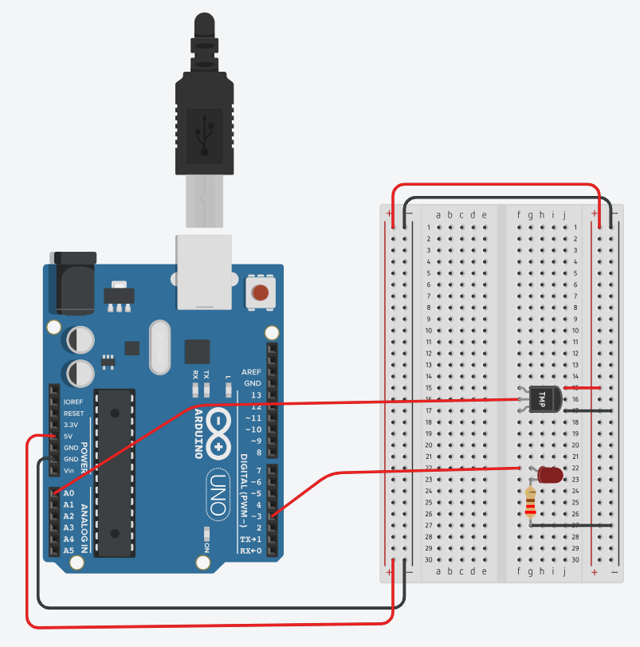
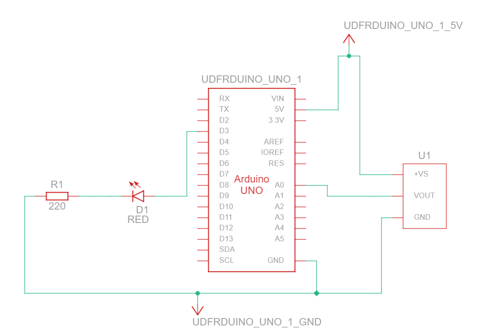
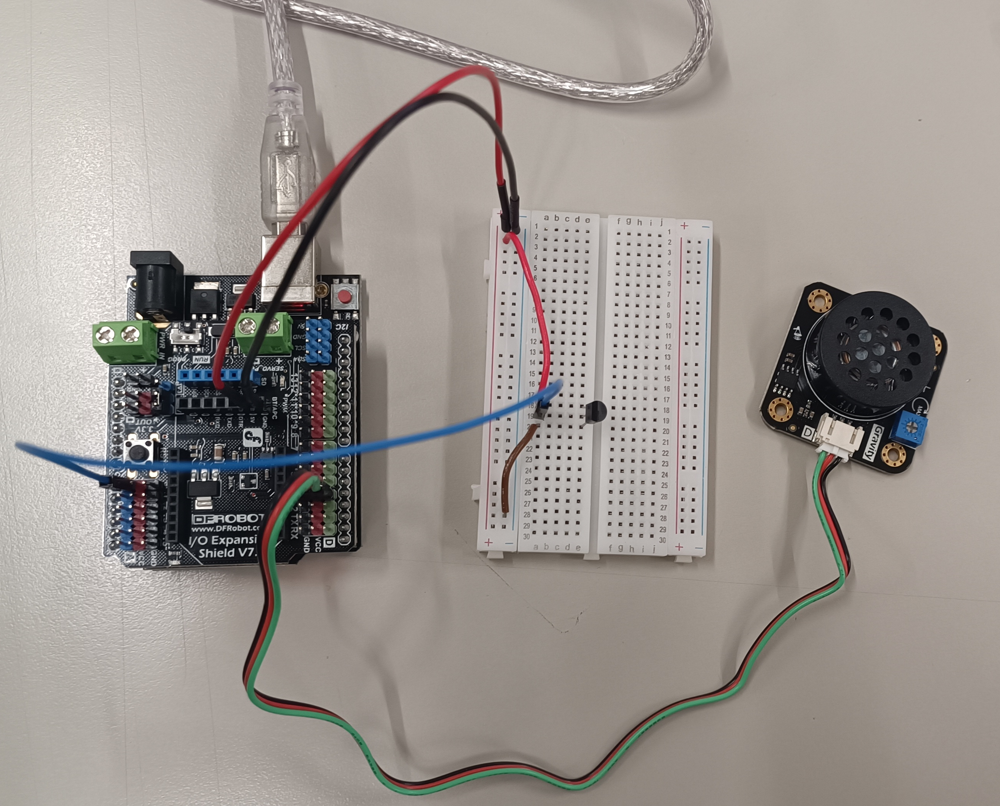

# Week 03 – Temperature Measurement and Closed-Loop Control using LM35 Sensor

## 🎯 Objective
In this activity, students will explore how the **LM35 temperature sensor** measures temperature and how it can be integrated into a **closed-loop control system**.  
The first experiment will visualize temperature readings and control an LED based on a threshold, while the second will activate a **speaker** when a temperature limit is reached.

---

## 🧩 Materials
- Arduino UNO (DFRduino R3)  
- Breadboard and jumper wires  
- LM35 temperature sensor  
- 220 Ω resistor  
- LED (5 mm)  
- Speaker module (for the second activity)  
- Gravity IO Expansion Shield (for the second activity)

---

## 🌡️ Temperature Measurement with LED

### Description
The LM35 outputs a voltage proportional to the temperature (10 mV per °C).  
This voltage is read by the Arduino’s analog input (A0), converted into Celsius, and displayed in the **Serial Plotter**.  
An LED turns ON when the temperature rises above a set threshold, helping students visualize the relationship between analog measurement and control output.

### Circuit Diagram and Breadboard

  

### ⚙️ Circuit Diagram

  

### Expected Behavior
- The Serial Plotter displays a live temperature curve.  
- Touching the LM35 increases the temperature reading; releasing it returns it to room temperature.  
- If the temperature exceeds a threshold, the LED turns ON.  
- Use the Serial Plotter to observe how temperature varies over time.

### Arduino Code
👉 [View Code: Temperature Measurement with LED](../programs/week_03_activity_01_temperature_measurement_led/week_03_activity_01_temperature_measurement_led.ino)

---

## 🔁 Closed-Loop Temperature Control with Speaker

### Description
In this second part, the LM35 sensor is integrated with a **speaker** connected through the **Gravity IO Expansion Shield**.  
This shield simplifies wiring and provides **dedicated power lines (5V and GND)** for modules such as the speaker, avoiding overloads on the Arduino board.

Since the Tinkercad platform does not include the **Gravity Shield** or the **three-wire speaker module** used in the Zero to Hero kit, the figure below shows the **real physical circuit** assembled and tested in the laboratory.

### Real Circuit (Physical Assembly)

  

> ⚙️ **Note on connections:**
> - **A0** → input for the **LM35 temperature sensor**  
> - **D3 (PWM)** → output for the **speaker signal**  
> - **Red wires** → connected to **5V**  
> - **Black wires** → connected to **GND**  
> - **Green wire** → speaker control signal (volume input)  
> - **Blue wire** → LM35 output (temperature signal)

In this configuration, the **sensor output (A0)** provides an analog value from 0 to 1023, which is **mapped internally** in the program to a range between **0 and 255**, controlling the **volume (PWM intensity)** of the speaker.

When the temperature surpasses a defined threshold (e.g., **22°C**), the speaker is activated and produces a tone whose **frequency and intensity increase** as the temperature continues to rise — operating like a simple **temperature alarm**.

### Expected Behavior
- The **speaker remains OFF** below 22°C.  
- When the temperature **exceeds 22°C**, the **speaker starts emitting sound**.  
- The tone becomes **higher and more frequent** as temperature increases.  
- The Gravity Shield ensures stable **power delivery** to the module.

### Arduino Code
👉 [View Code: LM35 Temperature Control with Speaker](../programs/week_03_activity_01_temperature_measurement_speaker/week_03_activity_01_temperature_measurement_speaker.ino)

---

## 🧠 Learning Outcome
After completing this activity, students will:
- Understand how the **LM35 converts temperature into voltage**.  
- Observe the interaction between **analog input and PWM output**.  
- Recognize the role of the **Gravity IO Expansion Shield** in powering external devices.  
- Implement a **basic closed-loop temperature alarm**.  
- Explore how control signals can modulate **sound intensity and frequency**.

---

## 🙏 Acknowledgment
These hands-on exercises are inspired by the  
🎥 [Arduino Hero to Zero YouTube playlist by Sanjin Dedić](https://www.youtube.com/playlist?list=PL_92WMXSLe_86NTWf0nchm-EmQIwccEye),  
which serves as the foundation for practical experimentation in this laboratory module.

