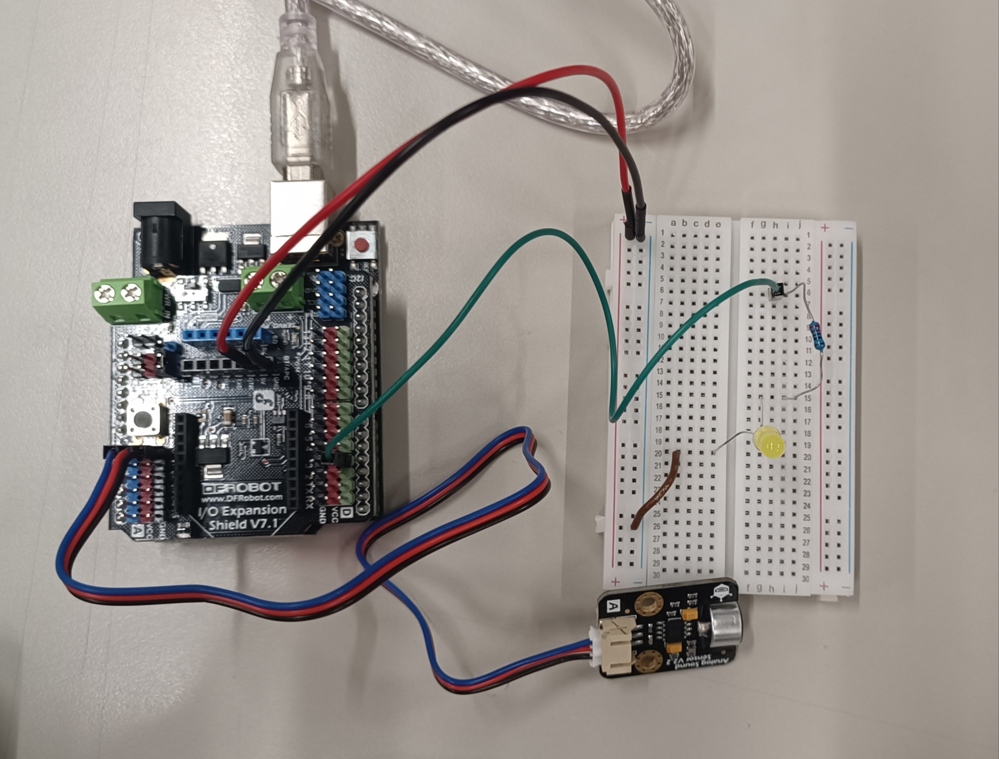
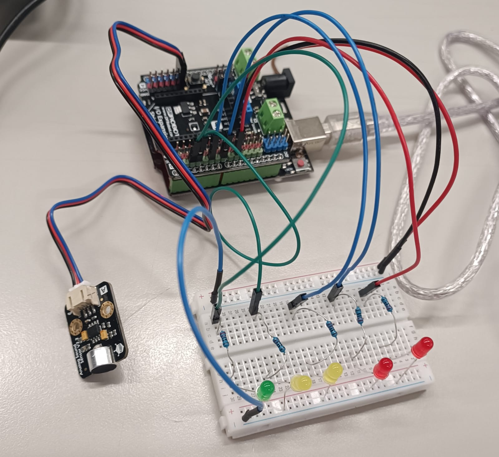

# Week 03 – Activity 02: Sound Detection and LED Visualization using Microphone Sensor

## 🎯 Objective
In this activity, students will learn how to use a **microphone sound sensor** to detect and visualize sound intensity through LEDs.  
The first experiment uses a **single LED** that lights up when the sound passes a threshold (e.g., a clap), and the second uses **five LEDs** that illuminate progressively according to the sound intensity.

---

## 🧩 Materials
- Arduino UNO (DFRduino R3)  
- Gravity IO Expansion Shield  
- Analog Microphone Sensor (Gravity: Analog Sound Sensor)  
- Breadboard and jumper wires  
- 1 × LED (5 mm) + 220 Ω resistor (for the first activity)  
- 5 × LEDs (5 mm) + 5 × 220 Ω resistors (for the second activity)

> ⚠️ **Note:**  
> The **Gravity IO Expansion Shield** and **microphone module** used in this activity are not available in Tinkercad.  
> Therefore, both circuits are shown using **real photos of the physical assemblies** built in the laboratory.  
> The shield simplifies connections by providing easy access to **5V, GND, and signal pins** for each component.

---

## 👏 Sound Detection with Single LED

### Description
The microphone sensor converts sound intensity into a variable voltage that can be read on the **analog input A0**.  
When this value exceeds a defined threshold (default = 100), the **LED on digital pin 3** lights up for **0.5 seconds**, then turns OFF automatically.  
This demonstrates a simple **sound-triggered response** (such as detecting a clap).

### Real Circuit (Physical Setup)

  

### Circuit Description
- **A0** → connected to the **microphone output**  
- **D3** → connected to the **LED** (through a 220 Ω resistor)  
- **Red wire** → 5V  
- **Black wire** → GND  
- **Microphone output** provides an analog voltage proportional to sound amplitude  

### Expected Behavior
- The LED remains **OFF** under normal ambient noise.  
- When a **clap** or loud sound** is detected (value > 100), the **LED turns ON for 0.5 seconds**.  
- The threshold can be adjusted in the code to change the sensitivity.

### Arduino Code
👉 [View Code: Sound Detection with Single LED](../programs/week_03_activity_02_soud_detection_1_led/week_03_activity_02_soud_detection_1_led.ino)

---

## 🔊 Sound Intensity Visualization with Multiple LEDs

### Description
In this activity, the same microphone sensor connected to **A0** measures sound intensity.  
Five LEDs connected to digital pins **3, 5, 6, 9, and 10** are activated progressively according to the amplitude of the sound signal.  
Each LED corresponds to a specific intensity threshold:
- **150** → LED 1 (pin 2)  
- **250** → LED 2 (pin 3)  
- **350** → LED 3 (pin 5)  
- **450** → LED 4 (pin 7)  
- **550** → LED 5 (pin 9)  

Each LED has a **220 Ω resistor**, forming a basic **sound intensity visualizer** (VU meter).

### Real Circuit (Physical Setup)

  

 

### Circuit Description
- **A0** → microphone output  
- **D2, D3, D5, D7, D9** → LEDs (each with 220 Ω resistor)  
- **Red wires** → 5V  
- **Black wires** → GND  
- The **Gravity Shield** provides organized power and ground lines for all devices.  

### Expected Behavior
- When you **speak softly**, only **one LED** lights up.  
- At **medium sound levels**, **2–3 LEDs** turn ON.  
- With a **loud sound or clap**, **4–5 LEDs** illuminate simultaneously.  
- The number of lit LEDs changes dynamically with sound intensity.

### Arduino Code
👉 [View Code: Sound Detection with 5 LEDs](../programs/week_03_activity_02_sound_detection_5_leds/week_03_activity_02_sound_detection_5_leds.ino)

---

## 🧠 Learning Outcome
After completing this activity, students will:
- Understand how an **analog microphone sensor** converts sound into voltage variations.  
- Implement **sound-triggered logic** using a single threshold.  
- Develop a **multi-level visual indicator** (VU meter) to represent sound intensity.  
- Learn how the **Gravity Shield** simplifies circuit organization and power distribution.  
- Observe the relationship between **analog input** and **digital**

